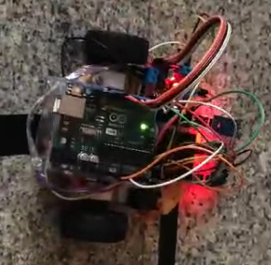

# 🤖 Line Follower Robot (Arduino + L298N + IR Sensors)

A simple **autonomous line follower robot** built using an **Arduino UNO**, **L298N motor driver**, and **3 IR sensors**.  
The bot follows a black line on a white surface by continuously reading sensor data and adjusting motor movement in real time.

---

## 🧠 Overview

This project demonstrates the working principle of a **line-following robot**, one of the most popular beginner-level robotics projects.  
Using **infrared (IR) sensors**, the robot detects the line and adjusts its path to stay on track.  
The system is controlled by an **Arduino**, which makes decisions based on sensor input and drives the motors through an **L298N motor driver**.

---

## ⚙️ Components Used

| Component | Quantity | Description |
|------------|-----------|-------------|
| Arduino UNO | 1 | Microcontroller board for processing sensor data |
| L298N Motor Driver | 1 | Controls motor speed and direction |
| IR Sensor Module | 3 | Detects black line on white surface |
| DC Motors | 2 | Moves the robot |
| Robot Chassis | 1 | Frame for mounting components |
| Wheels | 2 | For movement |
| Jumper Wires | - | Connections between components |
| Power Supply | 1 | 9V or 12V battery |

---

## 🧩 Circuit Connections

| Component | Arduino Pin | Description |
|------------|--------------|-------------|
| Left IR Sensor | A0 | Detects left edge of the line |
| Center IR Sensor | A1 | Detects center of the line |
| Right IR Sensor | A2 | Detects right edge of the line |
| L298N ENA | D5 | PWM for left motor speed |
| L298N IN1 | D8 | Motor direction |
| L298N IN2 | D9 | Motor direction |
| L298N ENB | D6 | PWM for right motor speed |
| L298N IN3 | D10 | Motor direction |
| L298N IN4 | D7 | Motor direction |

> 🧠 Make sure the GND of the Arduino, L298N, and battery are all connected together.

---

## 💻 Arduino Code

The code for this project is available in [`line_follower.ino`](line_follower.ino).  
It uses **three IR sensors** to detect the line and make directional decisions.  
Key logic:
- **Center sensor ON** → move **forward**  
- **Left sensor ON** → turn **left**  
- **Right sensor ON** → turn **right**  
- **All sensors OFF** → **stop**

---

## 🧭 Working Principle

1. **IR sensors** detect reflected light.  
   - White surface reflects IR light → sensor output = HIGH  
   - Black line absorbs IR light → sensor output = LOW  
2. The Arduino reads sensor data and decides motion:
   - If the line is **centered**, both motors move forward.  
   - If the line shifts **left**, the bot turns left.  
   - If the line shifts **right**, the bot turns right.  
3. **Motor speeds** are controlled using PWM pins for smooth movement.  

---

## 🛠️ Customization

- Adjust the **THRESHOLD** in the code for your lighting conditions.
- Tune PWM values (`analogWrite()`) for equal speed on both motors.
- If your bot wobbles, lower the turning PWM values slightly.

---

## 🖼️ Preview

  

👉 **[Click here to view or download the video directly](https://github.com/EmperorGonneBerserk/Line-Follower-Robot/raw/main/Line_Follower.mp4)**

## 🚀 Future Enhancements

- Add **PID control** for smoother line tracking.  
- Add **obstacle avoidance** using ultrasonic sensors.  
- Implement **speed control** based on curve detection.  
- Upgrade to **ESP32** for wireless telemetry and tuning.

---

## 👨‍💻 Author

**Shushrutha N Gowda**  
Embedded Systems & IoT Developer
[GitHub Profile](https://github.com/EmperorGonneBerserk)

---

> ⚡ Developed as part of an Arduino robotics series to explore autonomous navigation and sensor-based control.
